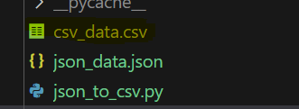

# json to csv convertor

## Introduction

This Python script allows you to convert json file to csv file and save them to a specified directory. It uses json and csv library to process json files and do manupulations accordingly.

## Usage

### Prerequisites

Before using this script, ensure you have the following:

- Python installed on your system.
- Required libraries: `csv`, `json`, `python`

### Running the Script

1. Place the json file you want to convert to csv file in the same directory as this script.

2. Replace the `input_file` variable with the name of your json file name with .json extention.

```python
input_file = 'json_data.json'
python json_to_csv_with_nested_dict.py
```

### Information about  .py file

1. `json_to_csv` function
   
- This function defines the JSON to CSV converter. It takes three arguments:
- Args :
    - **json_data**: A JSON object or list of JSON objects.
    - **csv_file**: The path to the CSV file to write the data to.
    - **mapping**: A dictionary mapping JSON field names to CSV column headers.
- Returns:
    - None

1. `flatten_json` function
   
- This function flattens the JSON data. It works by recursively iterating over the JSON object and converting any nested JSON objects into a single level of key-value pairs.
  
- Args :
    - **obj**: A nested JSON object.

- Returns:
    - A flattened JSON object.

### Output

The script will create a directory named **csv_data.csv** in the same location as the script. Within this directory.

