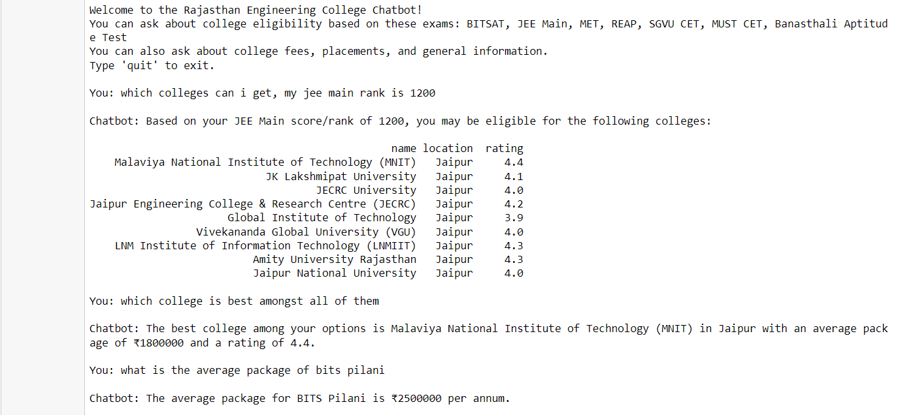
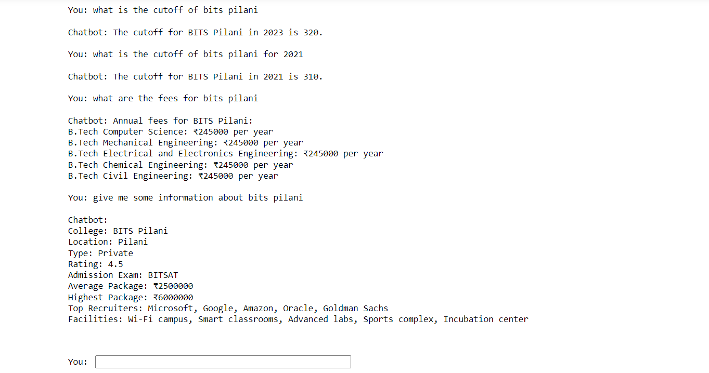

# Rajasthan Engineering College Chatbot

This project is a chatbot designed to provide detailed information about engineering colleges in Rajasthan. It can answer questions regarding cutoffs, fees, placements, and other important details for 30 colleges in the state. The chatbot interacts with users via a command-line interface, helping them find information based on their inputs like exam scores, desired colleges, and more.

# My Project

Here is an image of the project:




## Features

- **Cutoff Information**: Get cutoff details for specific colleges across different years.
- **College Eligibility**: Based on a user's exam score and exam type (e.g., JEE Main, BITSAT), the chatbot will return a list of eligible colleges.
- **Fee Structure**: Provides annual fee details for available courses at various colleges.
- **Placement Packages**: Information about average and highest placement packages offered by the top recruiters.
- **Best College Suggestion**: Recommends the best college based on weighted criteria, such as average package, highest package, rating, and cutoff.

## Problem Statement

The goal of this project is to create a Few Shot Language Agnostic Keyword Spotting (FSLAKWS) system capable of localizing and classifying keywords in variable duration audio files. The system should be language-agnostic, support various sample rates, and be able to upgrade to include additional keywords.

While this chatbot doesn’t fully implement all aspects of the FSLAKWS system, it serves as a working prototype to explore key features such as keyword localization and handling different query types.

## Tech Stack

- **Programming Language**: Python
- **Libraries**:
  - `pandas`: For data handling and processing.
  - `cohere`: For language model-based responses.
  - `fuzzywuzzy`: For fuzzy string matching to enhance college name recognition.
  - `dotenv`: To load API keys from environment files.
- **External APIs**:
  - Cohere API: Used to generate natural language responses.
- **Environment Management**: `dotenv` for API key security.

## Setup

### Prerequisites

Ensure you have Python 3.x installed and a virtual environment setup.

1. Clone the repository:
   ```bash
   git clone https://github.com/yourusername/rajasthan-college-chatbot.git
   cd rajasthan-college-chatbot
   ```

2. Install dependencies:
   ```bash
   pip install -r requirements.txt
   ```

3. Set up your environment variables. Create a `.env` file with the following content:
   ```
   COHERE_API_KEY=your-cohere-api-key
   ```

### Running the Chatbot

After setting up your environment:

```bash
python chatbot.py
```

You'll be greeted with a prompt where you can type questions like:
- "Which colleges can I get with a JEE Main score of 150?"
- "What is the cutoff for BITS Pilani in 2023?"
- "What are the fees for MNIT Jaipur?"

### Example Queries

- **Eligibility**: "Which colleges can I get with a JEE Main score of 180?"
- **Cutoff Info**: "Tell me the cutoff for BITS Pilani in 2022."
- **Fees**: "What are the fees for LNMIIT Jaipur?"
- **Best College**: "Which college is the best among my options?"

### Notes

- The dataset is limited to 30 colleges from Rajasthan.
- The project utilizes a pre-defined dataset and fuzzy matching for college names to account for variations in user input.
- You can improve or extend the dataset by adding more colleges and related information.

## To-Do / Future Improvements

- Add more colleges and exams to the dataset for broader applicability.
- Improve the language understanding and handling of more complex queries.
- Implement a web interface for ease of use and integration with other platforms.
- Add support for multiple languages.
  
## License

This project is licensed under the MIT License.
